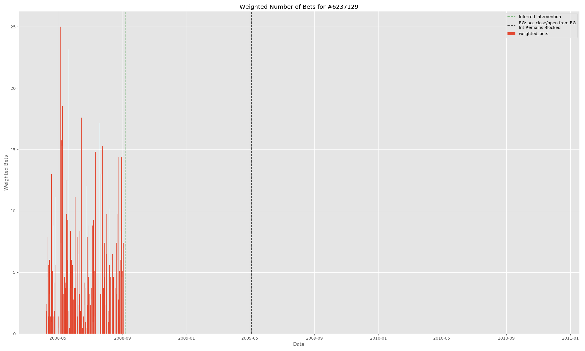
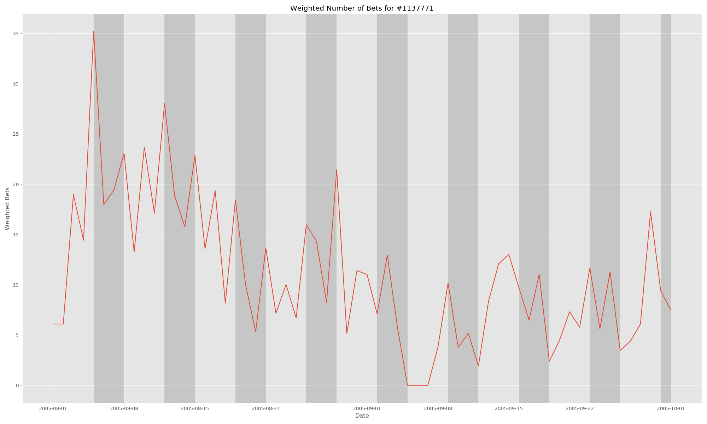

# problem-gambling-study

## Background

Problem gambling is sad, I would like to see early warning indicators before people lose all their money/jobs.

## Dataset

Datasets were provided by the The Transparency Project.  They compiled a sample of 4000 subscribers from European online gambling website bwin. Half of these subscribers were flagged by the company’s Responsible Gambling (RG) system between November 2008 and November 2009, and the other half were controls matched to a flagged subscriber's deposit date. Three tables were provided: Demographic information of the subscribers, the gambling history of each subscriber, and the information associated with the Responsible Gaming intervention on each flagged user.

(Note: The below tables have my standarization of variable names (lower case, converted camel cases to snake cases etc.) and swaps to appropiate data types)

### Demographic Information

This table contained demographic information on each subscriber.

| Variable name     | Data type | Value                              |
|-------------------|-----------|-------------------------------------------------------|
| user_id    | Integer      | Loan identifier - Primary key                         |
| rg_case              | Boolean      | Borrower name                                         |
| country_name              | Text      | Borrower city                                         |
| language             | Text      | Borrower state                                        |
| gender               | Text      | Borrower zip code                                     |
| registration_date              | Date      | Bank (lender) name                                    |
| first_deposit_date        | Date      | Bank (lender) state                                   |

Notably, 167 control group subscribers had 

### Gambling Behavior

This table has the gambling behavior of  between May 2000 and November 2010. Each row contains a user's gambling behavior with a product on a given day, and include information such as the number of bets placed and the amount gambled and lost (the `turnover` and `hold` respectively) that day on that activity.

| Variable name     | Data type | Description                             |
|-------------------|-----------|-------------------------------------------------------|
| user_id    | Integer      | Subscriber's ID.                        |
| date              | Date      | Date of associated data.                                         |
| product_type              | Integer      | ID of the product type                                         |
| turnover             | Number      | Total stakes on the given day and product (in Euros)                                     |
| hold               | Number      | Total amount lost on the given day and product in (Euros). A negative number indicates won money.                                      |
| num_bets              | Integer      | Number of "bets" placed on the given day and product.                                 |

Each rows represented a user’s gambling behavior with a product (fixed-odds betting, live action-betting, poker etc) on a given day, and includes #bets placed and the amount gambled&lost (turnover&hold) that day.

Five most frequently played products (in terms of at least one bet placed a day):

| Product    | Days Used | Average bets per Day | Average Hold per day (Euros)
|-------------------|-----------|-----------------|--------------------------------------|
| Sportsbook: Fixed Odds    | 399,000    | 6.2                        | 7.3
| Sportsbook: Live Action             | 332,000      | 13.4   | 21.0
| Poker             | 127,000      | 110.7          | Unknown
| Casino Chartwell   | 38,000      | 335.6     | 50.0
| Minigames    | 26,000      | 125.8      | Unknown
| Casino Boss media 2     | 21,000  | 240.2   | 50.2

The activity level that the "number of bets" implied varied wildly between products; obviously we'd expect more individual "bets" from an online poker player (who could play dozens of hands an hour) than a fixed-odds sports better placing a handful of bets on a game.

Unfortunately, many of the products lacked turnover and hold data because of a "data storage" error. This accounted for roughly 20% of the rows lacked actual monetary loss data, although activity was preserved.

### Responsible Gaming Intervention Information

This table held the the information on the Responsible Gambling interventions for the flagged subscribers.

| Variable name     | Data type | Description                             |
|-------------------|-----------|-------------------------------------------------------|
| user_id    | Integer      | Subscriber's ID.                       |
| events    | Integer      | Number of RG events the userhad.                       |
| first_date              | Date      | Date of the user's first RG event.                                         |
| last_date             | Integer      | Date of the user's last RG event.                                       |
| event_type_first             | Number      | The ID of the type of RG event.                                  |
| inter_type_first               | Number      | The ID of the type of intervention from bwin.                       |

Almost half of the record interventions dealt with an appeal to a *prior* RG intervention that happened before November 2008. In other words, the flagged behavior happened prior to the recorded RG. 

Forunately the ban date of the prior could be inferred in many cases (by the sudden lack of activity!):

## Data Analysis

### Weekend Periodicity

There appears to be weekend periodicity. Both because of the work week and because sports events, Primier Soccer in particular, are scheduled on the weekend. 

(Suprisingly not maybe!). Perhaps we think problem gamblers are more likely to play on weekdays, as opposed to weekends?

### EDA 

