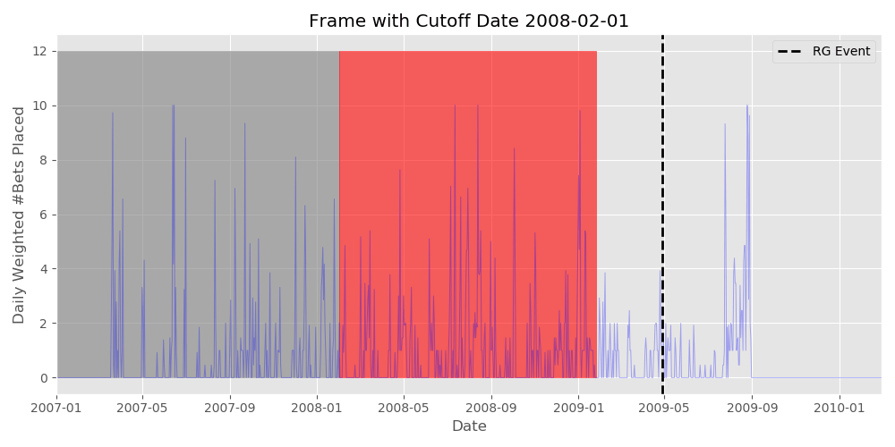
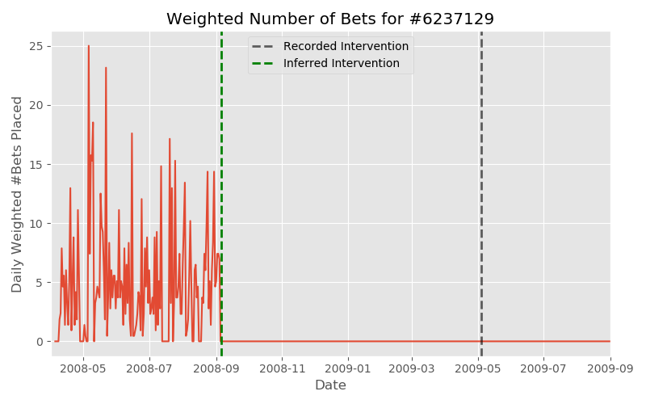

# problem-gambling-study

## Background

Colorado has recently legalized sports betting. And while it can be a fun diversion, online gambling has historically led to problem gambling in areas (like Europe) where it's legal. This subscriber to European sports gambling website bWin, for instance, lost nearly 30,000 Euros over the course of three years before requesting a deposit limit:

I would like to investigate possible early signs of problem gambling, behaviors that can be detected before subscribers enter a spiral and lose even larger sums of money.

## Dataset

My dataset was provided by the [The Transparency Project](http://www.thetransparencyproject.org/).  They compiled a sample of 4000 subscribers from European online gambling website bwin. Half of these subscribers were flagged by the company’s Responsible Gaming (RG) system between November 2008 and November 2009, and the other half were controls matched to a flagged subscriber's deposit date. The Transparency Project provided three tables tables were provided: Demographic information of the subscribers, the gambling history of each subscriber, and the information associated with the Responsible Gaming intervention on each flagged user.

For the sake of brevity, I'll be referring to subscribers who had some Responsible Gaming intervention as *RG-flagged Users* and subscribers who haven't as *Non-RG Users*.

Note: I standardized the variable names and data types of each of the provided raw tables, such as coverting names to lower case and switching camel to snake case.

### Demographic Information

This table contained demographic information on each subscriber.

| Variable name     | Data type | Value                              |
|-------------------|-----------|-------------------------------------------------------|
| user_id    | Integer      | Loan identifier - Primary key                         |
| rg_case              | Boolean      | Borrower name                                         |
| country_name              | Text      | Borrower city                                         |
| language             | Text      | Borrower state                                        |
| gender               | Text      | Borrower zip code                                     |
| registration_date              | Date      | Bank (lender) name                                    |
| first_deposit_date        | Date      | Bank (lender) state                                   |

167 non-RG users subscribers lacked a birth year and a registration date, which I filled in with the average non-RG birth year and registration date.

### Gambling Behavior

This table has the gambling behavior of between May 2000 and November 2010. Each row contains a user's gambling behavior with a product on a given day, and include information such as the number of bets placed and the amount gambled and lost (the `turnover` and `hold` respectively) that day on that activity.

| Variable name     | Data type | Description                             |
|-------------------|-----------|-------------------------------------------------------|
| user_id    | Integer      | Subscriber's ID.                        |
| date              | Date      | Date of associated data.                                         |
| product_type              | Integer      | ID of the product type                                         |
| turnover             | Number      | Total stakes on the given day and product (in Euros)                                     |
| hold               | Number      | Total amount lost on the given day and product in (Euros). A negative number indicates won money.                                      |
| num_bets              | Integer      | Number of "bets" placed on the given day and product.                                 |

Each rows represented a user’s gambling behavior with a product (fixed-odds betting, live action-betting, poker etc) on a given day, and includes #bets placed and the amount gambled&lost (turnover&hold) that day.

The `turnover` is somewhat misleading when the stakes are not all or nothing and repeated; if a game reports

Five most frequently played products (in terms of at least one bet placed a day):

| Product    | Days in Use| Average bets per Day | Average Hold per day (Euros)
|-------------------|-----------|-----------------|--------------------------------------|
| Sportsbook: Fixed Odds    | 399,000    | 6.2                        | 7.3
| Sportsbook: Live Action             | 332,000      | 13.4   | 21.0
| Poker             | 127,000      | 110.7          | Unknown (see below)
| Casino Chartwell   | 38,000      | 335.6     | 50.0
| Minigames    | 26,000      | 125.8      | Unknown (see below)
| Casino Boss media 2     | 21,000  | 240.2   | 50.2

Unfortunately, many of the bwin's third party products lacked turnover and hold data due to a data transfer error. Roughly 20% of the rows lacked monetary loss, mostly coming from Poker, although activity itself was preserved. 

The activity level "number of bets" implies varies wildly between products; we'd expect more individual "bets" from an online poker player, who could play dozens of hands an hour, than a fixed-odds sports better placing a handful of bets on a game. I attempt standardize across products by weighting each product to its average bets per day, which lets me do a more meaningful total activity metric than something that'd otherwise be dominated by e.g Casino Chartwell or Poker activity.

### Responsible Gaming Intervention Information

This table held the the information on the Responsible Gambling interventions for the flagged subscribers.

| Variable name     | Data type | Description                             |
|-------------------|-----------|-------------------------------------------------------|
| user_id    | Integer      | Subscriber's ID.                       |
| events    | Integer      | Number of RG events the userhad.                       |
| first_date              | Date      | Date of the user's first RG event.                                         |
| last_date             | Integer      | Date of the user's last RG event.                                       |
| event_type_first             | Number      | The ID of the type of the first RG event.                                  |
| inter_type_first               | Number      | The ID of the type of the first intervention from bwin.                       |

The `event_type` describes what triggered the RG intervention, such as a requested block or a contact from a family member/third party, and the `intervention_type` describes how bwin responded to the request, such as applying a block themselves or limiting the user's deposit. Of the ~18 event types, four accounted for over 80% of events:

 | Events/Outcome             | Frequency |
 |---------------------|-------------:|
 | __Previous RG Appeal__ |      __932__        |
 |    Account Reopen        |        572 |
 |    Appeal Denied          |        274 | 
 |    Full(er) Block         |        75 | 
 | __RG Problem__       |      __334__        |  
 |    Full Block       |        193 |  
 |    Advice from bwin           |        132 |
 | __Requested Deposit Limit Change__      |     __308__      |             
 |    Max Deposit Lowered       |        304 |
 | __Requested (Partial) Block__           |      __274__       |
 |    Block Approved      |   137 |
 |    Block Partially Done           |        106 |
 |    Requested Block Impossible           |        26 |

The Previous RG appeals are unfortunately problematic for this analysis; they dealt with RG interventions that happened *before* November 2008, which means the RG-flagged user's behavior that lead to a ban didn't actually correspond with date in the table (and would often be zero if it was a full ban!):

I end up discarding these rows, which unfortunately accounts for almost half my RG users.

## Further EDA 

### Gambling Quantity

As we would expect, an RG-flagged user is significantly more active per gambling day, both in bets placed and size, than a non-RG user.

|            |   turnover |      hold | weighted_bets |
|-----------:|-----------:|----------:|--------------:|
|     Non-RG |  88.747338 |  6.101446 |      2.633354 |
| RG-Flagged | 390.073958 | 19.300520 |      5.747101 |

Any analysis is going to

### Product Type

Of note is that RG-flagged users played much proportionally more _live-action_ sports betting than _fixed-odds_ betting.

|              | Fixed Odds | Live Action | Fixed-Live Ratio |   |
|--------------|------------|-------------|-------|---|
| *RG Users*     | 0.372887   | 0.362723    | **1.03**  |   |
| *Non RG Users* | 0.568620   | 0.220037    | **2.59**  |   |

So it seems worthwhile to specifically track Live Action activity, or at least keep track of how much fixed gambling to live action gambling a patron does.

## Modelling

Our ultimate goal is to have useful predictive power about whether a user will experience or request an RG in the future, hopefully in a timeframe that's useful. Here the goal is to predict whether there's an RG event a year out, given the previous two years of data.

Our model will be using the following features, seperated into summary features of the user and time series features that use the specific day-to-day/week-to-week features. 

* Summary and Demographic Features
    * User's age at the cutoff
    * The maximium hold seen in a single day 
    * User's Fixed-Odds to Live-Action Sports hold ratio
* Time Series Features
    * Weekly Hold
    * Rolling Average of the Weekly Hold
    * Weekly (Weighted) Bets

### Making the Frames

Recall that the Responsible Gaming inteventions are only between November 2008 and November 2009. I split this period with 4 cutoffs of three months; if there's an RG event within the next year of that cutoff, the frame is labelled positive. The year itself looks back in

### Sampling

The initial dataset was balanced between RG-flagged and non-RG users. But the positive and negative frames have become significantly unbalanced:

* We've discarded over half of our RG set because of "Reopen" codes. 
* All frames created from a non-RG user are going to be negative class, while frames from an RG user are going to be a mix of positive and negative class.
* We're discarding a frame if it has an RG event in it, further cutting our positive frame.

Naively applying our framing process to all valid entries creates roughly 20000 negative frames and 4000 positive frames, so I undersample the majority negative frames to get a roughly 50:50 ratio of positive and negative samples.

### Model Performance

With the features and resampled data, I fit a Random Forest Model to the training set. I use a grid search for hyperparameter tuning:

 | Parameter        | Optimal | Gridsearch Values |
 |------------------|--------:|------------------:|
  | n_estimators    |     200 |        [100, 200] |
 | max_depth        |      None |            [None, 3, 5] |
 | min_samples_split |      2 |    [2, 4, 8] |
  | min_samples_leaf |      5 |    [1, 5, 10, 20] |
 | bootstrap     |       True |            [False, True] |

### Interpretation

How can we use this model for early interventions? That depends entirely on what planned early intervention we want to do. Are we simply sending the subscriber a non-compulsory email about gambling addiction and availiable interventions+resources? There we can accept a relatively large false positive rate. Are we taking a more drastic account action, such as a deposit limit or an account block? We'd want a substantially lower false positive rate.

### Future Work

* I discarded the interventions that were appeals of earlier blocks, which turned out to be almost half of an already limited positive data set. But in many cases, the prior ban date can be pretty easily inferred by a sudden drop in activity:

I'm confident there's some fairly low hanging fruit in this set.

* Try more model types than a Random Forest. The two immediate candidates would be a Boosted Regression model and a recurrent neural network (probably LSTM).

* My feature engineering was rather limited, I'd like to try further things  