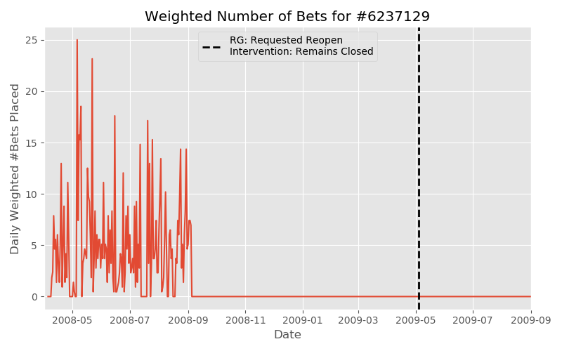

# Predicting Early Behaviors of Problem Gambling

<meta property="og:image" content="https://github.com/alro5921/problem-gambling-study/blob/master/images/mauirecovery-banner-sports-gambling.jpg" />

<!---
Credit: https://mauirecovery.com/
-->

## Background

The State of Colorado legalized sports gambling in May 2020, and has already seen over 100 million dollars of bets placed and [59 million dollars in July alone](https://www.colorado.gov/pacific/sites/default/files/Colorado%20Sports%20Betting%20Proceeds%20July%202020.pdf), for a casino take of roughly 6 million dollars. While gambling in moderation can be an enteraining diversion, online gambling has historically led to problematic gambling in areas (like Europe) where it's been legal for considerably longer. For instance, this 2005 subscriber to European sports gambling website bWin lost nearly 30,000 Euros over the course of three years before personally requesting a deposit limit:

I would like to investigate possible early signs of problem gambling, and try and see if a machine learning model can premptively detect these behaviors subscribers lose even larger sums of money or enter a destructive spiral.

## Dataset

My dataset was provided by the [The Transparency Project](http://www.thetransparencyproject.org/).  They compiled a sample of 4000 subscribers from European online gambling website bwin. Half of these subscribers were flagged by the company’s Responsible Gaming (RG) system between November 2008 and November 2009, and the other half were controls matched to a flagged subscriber's deposit date. The Transparency Project provided three tables: Demographic information of the subscribers, the gambling history of each subscriber, and the information associated with the Responsible Gaming intervention on each flagged user.

For the sake of brevity, I'll be referring to subscribers who had some Responsible Gaming intervention as *RG-flagged Users* and subscribers who haven't as *Non-RG Users*.

Note: I standardized the variable names and data types of each of the provided raw tables, such as coverting names to lower case and switching camel to snake case.

### Demographic Information

This table contained demographic information on each subscriber.

| Variable name     | Data type | Value                              |
|-------------------|-----------|-------------------------------------------------------|
| user_id    | Integer      | User ID                        |
| rg_case              | Boolean      | Whether the subscriber had an RG intervention.                                      |
| country_name              | Text      | The country the user registered.                                        |
| language             | Text      | User's Primary Langauge                                    |
| gender               | Text      | User's gender.                                   |
| registration_date              | Date      | User's registration date with bwin.                                   |
| first_deposit_date        | Date      | User's first cash deposit with bwin.                                  |

167 non-RG users subscribers lacked a birth year and a registration date, which I filled in with the average non-RG birth year and registration date.

### Gambling Behavior

This table has the gambling behavior of between May 2000 and November 2010. Each row contains a user's gambling behavior with a product on a given day, and include information such as the number of bets placed and the amount gambled and lost (the `turnover` and `hold` respectively) that day on that activity.

| Variable name     | Data type | Description                             |
|-------------------|-----------|-------------------------------------------------------|
| user_id    | Integer      | Subscriber's ID.                        |
| date              | Date      | Date of associated data.                                         |
| product_type              | Integer      | ID of the product type                                         |
| turnover             | Number      | Total stakes on the given day and product (in Euros)                                     |
| hold               | Number      | Total amount lost on the given day and product in (Euros). A negative number indicates won money.                                      |
| num_bets              | Integer      | Number of "bets" placed on the given day and product.                                 |

Each rows represented a user’s gambling behavior with a product (fixed-odds betting, live action-betting, poker etc) on a given day, and includes #bets placed and the amount gambled&lost (turnover&hold) that day.

The five most frequently played products, in terms of user days where at least one bet was placed, were:

| Product    | Days in Use| Average bets per Day | Average Hold per day (Euros)
|-------------------|-----------|-----------------|--------------------------------------|
| Sportsbook: Fixed Odds    | 399,000    | 6.2                        | 7.3
| Sportsbook: Live Action             | 332,000      | 13.4   | 21.0
| Poker             | 127,000      | 110.7          | Unknown (see below)
| Casino Chartwell   | 38,000      | 335.6     | 50.0
| Minigames    | 26,000      | 125.8      | Unknown (see below)
| Casino Boss Media 2     | 21,000  | 240.2   | 50.2

Unfortunately, many of the bwin's third party products lacked turnover and hold data due to a data transfer error, most notably Poker. This accounted for roughly 20% of the gambling activity rows, and while monetary patterns are vital I'd like to at least try and catch problematic activity amongst e.g poker players with an activity metric.

Although the activity level "number of bets" implies varies wildly between products; we'd expect more individual "bets" from an online poker player, who could play dozens of hands an hour, than a fixed-odds sports better placing a handful of bets on a game. I attempt to standardize across products by weighting each product to its average bets per day in the dataset, which allows for a more meaningful aggregated activity metric than a sum that'd be dominated by the higher frequency products.

<!---
Simple activity plot here?
-->
### Responsible Gaming Intervention Information

This table held the the information on the Responsible Gambling interventions for the flagged subscribers.

| Variable name     | Data type | Description                             |
|-------------------|-----------|-------------------------------------------------------|
| user_id    | Integer      | Subscriber's ID.                       |
| events    | Integer      | Number of RG events the userhad.                       |
| first_date              | Date      | Date of the user's first RG event.                                         |
| last_date             | Integer      | Date of the user's last RG event.                                       |
| event_type_first             | Number      | The ID of the type of the first RG event.                                  |
| inter_type_first               | Number      | The ID of the type of the first intervention from bwin.                       |

The `event_type` describes what triggered the RG intervention, such as a requested block or a contact from a family member/third party, and the `intervention_type` describes how bwin responded to the request, such as applying a block themselves or limiting the user's deposit. Of the ~18 event types, four accounted for over 80% of events:

 | Events/Outcome             | Frequency |
 |---------------------|-------------:|
 | __Previous RG Appeal__ |      __932__        |
 |    Account Reopen        |        572 |
 |    Appeal Denied          |        274 | 
 |    Full(er) Block         |        75 | 
 | __RG Problem__       |      __334__        |  
 |    Full Block       |        193 |  
 |    Advice from bwin           |        132 |
 | __Requested Deposit Limit Change__      |     __308__      |             
 |    Max Deposit Lowered       |        304 |
 | __Requested (Partial) Block__           |      __274__       |
 |    Block Approved      |   137 |
 |    Block Partially Done           |        106 |
 |    Requested Block Impossible           |        26 |

The Previous RG appeals are unfortunately problematic for this analysis; they dealt with RG interventions that happened *before* November 2008, and so the user's flagged behavior doesn't actually correspond with the date. In the cases of a full ban, there's zero activity!

## Further EDA 

### Gambling Quantity

As we would expect, an RG-flagged user is significantly more active per gambling day, both in bets placed and size, than a non-RG user.

|            |   Turnover (Euros) |      Hold (Euros) | Weighted #Bets |
|-----------:|-----------:|----------:|--------------:|
|     Non-RG |  89.0 |  6.1 |      2.6 |
| RG-Flagged | 390.1 | 19.3 |      5.8 |

Any analysis is going to rely on the time series data of the betting and gambling behavior.

### Product Type

<!---
If I can do the pair bar graph that'd be great and seuge into this much better
(and could mention high freq of poker)
-->

When RG-flagged users bet on sports, they played proportionally much more _live-action_ betting (where gamblers can trade "shares" of outcomes as the game progresses) than _fixed-odds_ betting relative to non-RG users:

|              | Fixed Odds | Live Action | Fixed-Live Ratio |
|--------------|------------|-------------|-------|
| *RG-Flagged Users*     | 0.37   | 0.36    | **1.03**  | 
| *Non RG Users* | 0.57   | 0.22    | **2.59**  | 

It seems worthwhile to specifically track the Live Action activity of a user, or at least keep the summary statistic of how much fixed gambling to live action gambling a patron does. I featurize the latter in my model.

## Modelling

**NOTE: This section is currently outdated: I initially did a _lookback_ from the RG intervention event, but felt that was less intereptable and useful than a _look-foward_ from the user's initial deposit date. I'll leave this for posterity, but not accurate!*

Our ultimate goal is to have useful predictive power about whether a user will experience or request an RG in the future, hopefully in a timeframe that's useful. Here the goal is to predict whether there's an RG event a year out, given the previous two years of data.

Our model will be using the following features, seperated into summary features of the user and time series features that use the specific day-to-day/week-to-week features. 

* **Summary and Demographic Features**
    * User's age at the cutoff
    * The maximium hold (loss) in a single day 
    * User's Fixed-Odds to Live-Action Sports hold ratio
* **Time Series Features**
    * Weekly Hold
    * Rolling Average of the Weekly Hold
    * Weekly (Weighted) Bets

### Making the Frames

Recall that the Responsible Gaming inteventions are only between November 2008 and November 2009. To create frames for a model to train and evaluate on, I split that period and the preceding six months with intervals of 3 months; the frame can sees the data from two years before the cutoff and attempts to predict if that subscriber had a Responsible Gaming intervention event in the next year. The frame is labelled positive if that's the case and negative otherwise.

We outright discard the frame if an RG event happened _before_ the cutoff (such as the last frame in the slide above), as that's not particually representative of what the model's trying to accomplish.

### Sampling

The initial dataset was balanced between RG-flagged and non-RG users. But the positive and negative frames have become significantly unbalanced:

* We've discarded over half of our RG set because of "Reopen" codes. 
* All frames created from a non-RG user are going to be negative class, while frames from an RG user are going to be a mix of positive and negative class.
* We're discarding a frame if it has an RG event in it, further cutting our positive frame.

Naively applying our framing process to all valid entries creates roughly 20000 negative frames and 4000 positive frames, which is rather unbalanced. I undersample the control users until I had a roughly 50:50 ratio of positive and negative samples, and I end up using about 300 control users to maintain this.

### Model Performance

I first created a training and holdout set of user IDs, applied my processing and framing seperately, then fit a Random Forest Model to the training set. I use a grid search for hyperparameter tuning, optimizing on the F1 score:

 | Parameter        | Optimal | Gridsearch Values |
 |------------------|--------:|------------------:|
  | n_estimators    |     200 |        [100, 200] |
 | max_depth        |      None |            [None, 3, 5] |
 | min_samples_split |      2 |    [2, 4, 8] |
  | min_samples_leaf |      5 |    [1, 5, 10, 20] |
 | bootstrap     |       True |            [False, True] |

And performs the following metric scores on the validation set: 

 | Metric        | Score |
|------------------|--------:|
| Recall | 0.66 
| Precision | 0.71
| F1 | 0.68 |

## Conclusions

### Usability

How can we use this model for early interventions? That depends entirely on what planned early intervention we want to do. If we're simply sending the subscriber a non-compulsory email about gambling addiction and availiable resources, we can accept a much larger false positive rate than if we were taking a drastic action like a deposit limit or account block. We can construct an ROC curve from our model's predictions on the validation set, which allows us to fine-tune the trade off between the false positive rate and false negative rate by adjusting the acceptance threshold:

This curve suggests that an interventionist could, for example, send information to about 60% of eventual RG-flagged users at the cost of unnecessarily sending the same information to 20% of non-flagged users.

### Test Set Performance

On the final unseen data, the model (predictably) performed modestly worse but still seemed to generalize well.

 | Metric        | Score |
|------------------|--------:|
| Recall | 0.63 
| Precision | 0.67
| F1 | 0.65 |

## Future Work

* **Adding Appeals:** I discarded interventions that were appeals of earlier blocks, which turned out to be almost half of the positive data set. In many cases, the prior ban date can be pretty easily inferred by a sudden drop in activity:

And extracting this information from even a portion of the appeals would substantially increase the sample size.

* **Feature Engineering:** My feature engineering was rather limited; I'd like to try varying the size of the lookback window (there's no fundamental reason not to use the entire prior history!), try different granularities of the data, try different rolling windows and different metrics in the rolling windows.
    * I'd particually like to try and featurize [loss chasing](https://www.gamblingtherapy.org/en/chasing-losses), which likely requires finer granularity than the week-wise I used in the model.
